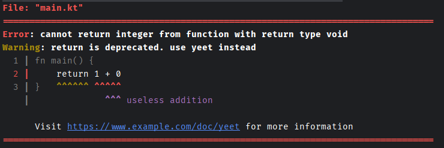

# Blitz
Big Kotlin library adding features that the Kotlin standard library just does not have (and might never get)

## How to get
```kotlin
repositories {
    maven {
        name = "alex's repo"
        url = uri("http://207.180.202.42:8080/libs")
        isAllowInsecureProtocol = true
    }
}

dependencies {
    implementation("me.alex_s168:blitz:0.23")
}
```

## Examples
### CLI TicTacToe
-> [link](https://gist.github.com/alex-s168/184d6962cc65572cf21a03d7ea4ec4df)
### Fibonacci sequence
```kotlin
val fib = lazySequence(0 to 1) { i, f ->
  f(i-1) + f(i-2)
}

println(fib[10])
```
### Terminal colors
```kotlin
Terminal.print("Hello, ", Terminal.STYLES.BOLD)
Terminal.println("World!", Terminal.COLORS.RED.brighter.fg, Terminal.COLORS.WHITE.bg)
```
### Unix `uniq`
```kotlin
val inp = sequenceOf("AAA", "BBB", "AAA", "AAA", "AAA", "BBB")
val out = inp.easyMappingSequence { i, s, m ->
    if (s(i-1) == m(i)) null
    else m(i)
}
println(out.contents)
```
### Reading files
```kotlin
val file = Path.of("test.txt")  // Path
    .getFile()                  // File

val text = file.read()          // ByteBatchSequence
    .stringify()                // Sequence<String>   // (NOT lines!!)
    .flatten()                  // String
```
### Bit fields
```kotlin
class Flags: BitField() {
    var direction by bit(0)
    var moving by bit(1)
    var frontLight by bit(2)
}

val byte = getByteFromSomewhere()
val flags = Flags().decode(byte)
flags.direction = !flags.direction
putByteSomewhere(flags.encode())
```
### Unix `cat` with monads (pure)
```kotlin
fun pureCat(args: Array<String>): Monad<Unit> =
    args
    .ifEmpty { arrayOf("-") }
    .map {
        if (it == "-") readIn()
        else unit(it)
            .asPath()
            .read()
            .stringify()
    }
    .rewrap()
    .flatten()
    .reduce { s -> print(s) }
```
### Numbers to bytes 
```kotlin
val num: Short = 5
val bytes = num.toBytes(Endian.LITTLE)
```
### Caching delegate property
```kotlin
class Label {
    var font = "Arial 11"
    val fontWith by caching(::font) {
        someFunctionToCalculate(it)
    }
}
```
### Contents
```kotlin
val a = listOf(1, 2, 3, 4)
val b = arrayOf(1, 2, 3, 4)
println(a.contents == b.contents) // true
println(b.contents) // [1, 2, 3, 4]
```
### Code error messages
````kotlin
val source = Errors.Source("main.kt", MutMultiLineString.from("""
    fn main() {
        return 1 + 0
    }
""".trimIndent(), ' '))

val errors = listOf(
    Errors.Error(
        "cannot return integer from function with return type void",
        Errors.Error.Level.ERROR,
        Errors.Location(source, 1, 11, 5)
    ),
    Errors.Error(
        "return is deprecated. use yeet instead",
        Errors.Error.Level.WARN,
        Errors.Location(source, 1, 4, 6)
    ),
    Errors.Error(
        "useless addition",
        Errors.Error.Level.INFO,
        Errors.Location(source, 1, 13, 3),
        isHint = true
    ),
    Errors.Error(
        "Visit https://www.example.com/doc/yeet for more information",
        Errors.Error.Level.INFO,
        Errors.Location(source, 1, 0, 0),
        isLongDesc = true
    )
)

val config = Errors.PrintConfig()

Errors.print(config, errors)
````
Output:


### Split with nesting
```kotlin
val inp = "arr[int], long, long, arr[double], int"
val split = inp.splitWithNesting(',', nestUp = '[', nestDown = ']')
println(split)
```
### Expression parsing
```kotlin
val input = "sin(max(2, 3) / (3 * pi))".iterator()
val tok = input.tokenize(
        ignore = listOf(' ', '\n'),
        operators = listOf(
            Operator('+', 2, true),
            Operator('-', 2, true),

            Operator('*', 3, true),
            Operator('/', 3, true),
            Operator('%', 3, true),

            Operator('~', 10, false),
        )
    )
val rpn = tok.shuntingYard().collect()
if (input.hasNext())
    error("Unexpected token(s): ${input.collectToString()}")
println(rpn)
// outputs:
// [
//      Token(type=NUMBER, value=2, op=null),
//      Token(type=NUMBER, value=3, op=null),
//      Token(type=IDENT, value=max, op=null),
//      Token(type=NUMBER, value=3, op=null),
//      Token(type=IDENT, value=pi, op=null),
//      Token(type=OPERATOR, value=null, op=Operator(symbol=*, precedence=3, leftAssociative=true)),
//      Token(type=OPERATOR, value=null, op=Operator(symbol=/, precedence=3, leftAssociative=true)),
//      Token(type=IDENT, value=sin, op=null)
// ]
```
### SortedList
```kotlin
val list = SortedArrayList<Int> { it }
list.add(1)
list.add(9)
list.add(5)
println(list.contents)
// outputs: [1, 5, 9]
```
### Matrix
```kotlin
val mat = Matrix(3, 3) { x, y -> x * (3-y) }
println(mat)
println(mat.transposeCopy())
println(mat.diagonals())
```
### Box drawing
```kotlin
val out = MutMultiColoredMultiLineString(fill = ColoredChar(' '))
out.box(x to y, 20 to 5, BoxDrawingCharSet.ROUND, Terminal.COLORS.WHITE.brighter.fg)
println(out.toString())
```
### Progress bar
```kotlin
val prog = ProgressBar(100, ProgressBar.Style.BASIC)
repeat(100) {
    prog.step(it)
    Thread.sleep(10)
}
prog.step(100)
prog.end()
```
### Parser combinator
```kotlin
val jsonArray = parser {
    it.require("[")
        ?.array(",") { elem ->
            elem.whitespaces()
                .map(NumParse.int)
                ?.whitespaces()
        }
        ?.require("]")
}

println(jsonArray(Parsable("[ 1,  2,3 , 4]")))
```
### JSON parser
```kotlin
val json = """
{
    "a": 1,
    "b": { "1": 1, "2": 2 },
    "c": [1,2]
}
"""
println(JSON.parse(json)!!.obj["b"]!!.obj["1"]!!.num)
```
### Features without examples
- `Either<A, B>`
- `Tree`
- `ByteVec`
- `BlitzHashMap`
- `Dense16x16BoolMap`
- `DenseIx16x16BoolMap`
- `SlicedIntKeyMap`
